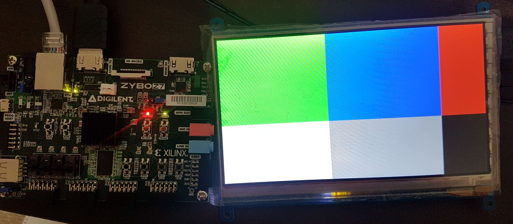
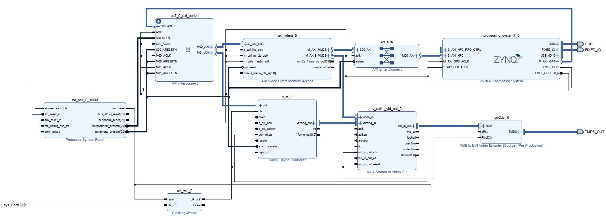

# HDMI Output with ZYBO
This is a Vivado project to output image data stored in DDR memory to TMDS output port.

## Project details (Hopefully, Google translation works)
https://translate.google.com/translate?hl=ja?sl=en&sl=ja&tl=en&u=https%3A%2F%2Fqiita.com%2Ftake-iwiw%2Fitems%2Fb323e129f96426031f9f

## Environment
- HostPC: Windows 10 64-bit
	- Vivado 2017.4 WebPACK
	- Xilinx SDK 2017.4
- Target Board:
	- ZYBO (Z7-20)
- Third party IP library:
	- Digilent Vivado library (https://github.com/Digilent/vivado-library)

## How to import this block design to your own project
- Download Digilent Vivado library (https://github.com/Digilent/vivado-library)
- Add Digilent Vivado library to IP Repositories in your project
	- PROJECT MANAGER -> Settings -> IP -> Repository. Then add the directory you downloaded
- Copy "design_mem2hdmi.tcl" to your local work space (e.g. c:/work)
- In Tcl Console, run the following command:
	- `cd c:/work`
	- `source design_mem2hdmi.tcl`

__Make sure you use the same version of Vivado (2017.4)__

## Project structure
- ip_repo\vivado-library\
	- Vivado IP library provided by Digilent (MIT license)
- project_hdmi_out.srcs\sources_1\bd\
	- design_1.bd
		- top module including PS and IPs related to HDMI output (vdma, vtc, rgb2dvi)
		- you can use this as a sample project
	- design_mem2hdmi.bd
		- block design including IPs related to HDMI output (vdma, vtc, rgb2dvi)
		- `design_mem2hdmi.tcl` is made from this block design
- project_hdmi_out.sdk\
	- C application to display two image buffers (solid color image and color bar image)

## Default settings
The settings for IPs are following. Please modify them as you want.

- AXI Video Direct Memory Access (axi_vdma_0)
	- Frame Buffer num: 1
	- Write Channel is disabled
	- Read Channel is enabled
		- Memory Map Data Width: 64
		- Read Burst Size: 8
		- Stream Data Width: 24
		- Line Buffer Depth: 2048
		- Fsync Options: None
		- GenLock Mode: Slave
- AXI4-Stream to Video Out (v_axi4s_vid_out_0)
	- AXI4S Video Input Component Width: Manual (8)
	- Clock Mode: Independent
- Video Timing Controller (v_tc_0)
	- Disable Detection
	- 720p (1280 x 720)
- Clocking Wizard (clk_wiz_0)
	- CLK_IN1: sys clock (125MHz)
	- clk_out1: 74.25MHz
- RGB to DVI Video Encoder (rgb2dvi_0)
	- TMDS clock range: < 80MHz (720p)

## I/O pins connection
- SYS_CLOCK
	- External clock (125MHz): K17
- TMDS_OUT (HDMI)
	- clk_p: H16
	- data_p[0]: D19
	- data_p[1]: C20
	- data_p[2]: B19

## Whole block design diagram

